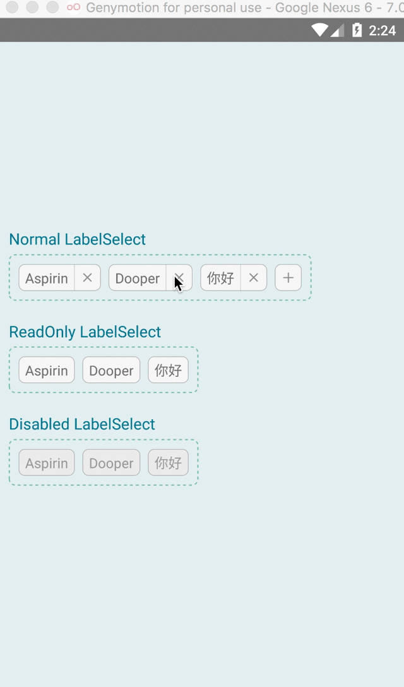
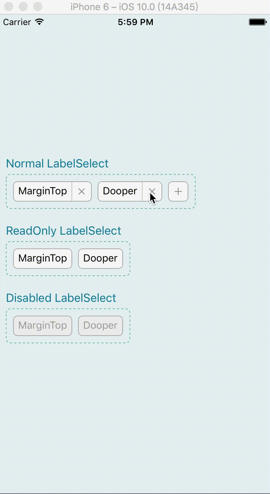

## react-native-labelSelect [](https://travis-ci.org/Tinysymphony/react-native-labelSelect)
LabelSelect is a component used for making multiple choices. The modal is an checkbox like html.

## Example
<a href="#android" id="android"></a>

<a href="#ios" id="ios"></a>


## usage

```js
import LabelSelect from 'your-position';
const {Label, ModalItem} = LabelSelect
```

```html
<LabelSelect
  ref="labelSelect"
  title="Make Choices"
  enable={true}
  readOnly={false}
  enableAddBtn={true}
  style={yourStyle}
  onConfirm={(list) => {...}}>
  
  <Label
    key={...}
    data={itemA}
    onCancel={func}>selected ItemA</Label>
  <ModalItem
    key={...}
    data={itemB}>Item B</ModalItem>
</LabelSelect>

```

## Properties

**LabelSelect**

| Prop | Default | Type | Description |
| --- | --- | --- | --- |
| style | - | object | Specify styles for the LabelSelect |
| title | - | string | The title text of the modal |
| readOnly | false | bool | is the component readonly |
| enable | true | bool | is the component interactive  |
| enableAddBtn | true | bool | whether to show the add button |
| onConfirm | - | function | Triggered when the confirm button of modal is pressed with the newly selected items list passed as the only argument |


**Label**


| Prop | Default | Type | Description |
| --- | --- | --- | --- |
| onCancel | - | function | Triggered when the close button of Label is pressed. |
|data| -| any | Data that bind to the Label |

**ModalItem**


| Prop | Default | Type | Description |
| --- | --- | --- | --- |
| data | - | any | Data that bind to the ModalItem. After confirming the items selected on modal, the data will be passed to the selected list. |


